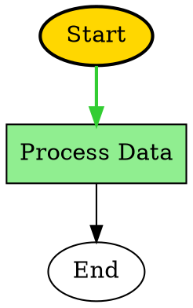

# Visualization and Realtime Highlighting

SemanticKernel.Graph provides comprehensive visualization capabilities with multi-format export support and real-time execution highlighting. This reference covers the complete visualization ecosystem including export formats, real-time highlighting, and execution overlays.

## GraphVisualizationEngine

The central component for generating visualizations in multiple formats with advanced styling and customization options.

### Constructor

```csharp
public GraphVisualizationEngine(GraphVisualizationOptions? options = null, IGraphLogger? logger = null)
```

**Parameters:**
* `options`: Visualization configuration options
* `logger`: Logger instance for diagnostics

### Methods

#### Graph Structure Serialization

```csharp
/// <summary>
/// Serializes the graph structure to DOT format for GraphViz rendering.
/// </summary>
public string SerializeToDot(GraphVisualizationData visualizationData, DotSerializationOptions? options = null)

/// <summary>
/// Serializes the graph structure to JSON format for API consumption.
/// </summary>
public string SerializeToJson(GraphVisualizationData visualizationData, JsonSerializationOptions? options = null)

/// <summary>
/// Generates an enhanced Mermaid diagram with advanced styling and features.
/// </summary>
public string GenerateEnhancedMermaidDiagram(GraphVisualizationData visualizationData, MermaidGenerationOptions? options = null)

/// <summary>
/// Serializes the graph structure to SVG format for web display.
/// </summary>
public string SerializeToSvg(GraphVisualizationData visualizationData, SvgSerializationOptions? options = null)
```

**Parameters:**
* `visualizationData`: Graph visualization data containing nodes, edges, and execution state
* `options`: Format-specific serialization options

**Returns:** Formatted string representation in the requested format

### Supported Export Formats

#### DOT Format (GraphViz)
Professional-grade graph visualization format for GraphViz rendering with advanced layout options.

**Features:**
* Layout control (top-to-bottom, left-to-right, bottom-to-top, right-to-left)
* Node clustering and grouping
* Custom styling for nodes and edges
* Execution path highlighting
* Node type information display

**Example Output:**


#### JSON Format
Structured data format for API consumption, data exchange, and programmatic visualization.

**Features:**
* Hierarchical representation of graph structure
* Metadata inclusion (timestamps, execution metrics, layout information)
* API-ready format for web and mobile consumption
* Extensible structure with custom properties
* Efficient serialization for large graphs

**Example Output:**
```json
{
  "metadata": {
    "generatedAt": "2025-08-15T10:30:00Z",
    "nodeCount": 3,
    "edgeCount": 2,
    "hasExecutionPath": true,
    "currentNodeId": "process"
  },
  "nodes": [
    {
      "id": "start",
      "name": "Start",
      "type": "FunctionGraphNode",
      "isExecutable": true,
      "isCurrentNode": false,
      "isInExecutionPath": true
    }
  ],
  "edges": [
    {
      "from": "start",
      "to": "process",
      "label": "success",
      "type": "directed"
    }
  ],
  "executionPath": [
    {
      "nodeId": "start",
      "nodeName": "Start",
      "order": 0
    }
  ]
}
```

#### Mermaid Format
Web-friendly diagram format with enhanced styling and real-time highlighting support.

**Features:**
* Multiple layout directions (TB, LR, BT, RL)
* Advanced styling with CSS classes
* Execution path highlighting
* Node type-based styling
* Performance indicators
* Multiple themes (Default, Dark, Forest, Base, Neutral)

**Example Output:**
```mermaid
graph TD
    %% Graph generated at 2025-08-15 10:30:00
    
    start((Start))
    process[Process Data]
    end((End))
    
    start -->|success| process
    process -->|completed| end
    
    %% Real-time highlight styles
    classDef currentNode fill:#FFD700,stroke:#FF8C00,stroke-width:3px
    classDef executedNode fill:#90EE90,stroke:#32CD32,stroke-width:2px
    classDef pendingNode fill:#F0F0F0,stroke:#808080
    
    class process currentNode
    class start executedNode
```

#### SVG Format
Vector graphics format for web display and static image generation.

**Features:**
* Configurable canvas dimensions
* Customizable node spacing
* Metrics overlay display
* Execution path highlighting
* Current node emphasis

## GraphRealtimeHighlighter

Live execution path tracking with visual highlights and real-time updates.

### Constructor

```csharp
public GraphRealtimeHighlighter(
    IGraphExecutionEventStream? eventStream = null,
    GraphRealtimeHighlightOptions? options = null,
    IGraphLogger? logger = null)
```

**Parameters:**
* `eventStream`: Optional event stream for automatic updates
* `options`: Highlighting configuration options
* `logger`: Logger instance for diagnostics

### Methods

#### Execution Highlighting

```csharp
/// <summary>
/// Starts highlighting for a specific execution.
/// </summary>
public void StartHighlighting(string executionId, GraphVisualizationData visualizationData)

/// <summary>
/// Updates the current node for an execution.
/// </summary>
public void UpdateCurrentNode(string executionId, IGraphNode currentNode, IReadOnlyList<IGraphNode> executionPath)

/// <summary>
/// Adds completion highlight for a node.
/// </summary>
public void AddNodeCompletionHighlight(string executionId, IGraphNode node, bool success, TimeSpan executionTime)

/// <summary>
/// Stops highlighting for a specific execution.
/// </summary>
public void StopHighlighting(string executionId)
```

#### Highlighted Visualization Generation

```csharp
/// <summary>
/// Generates highlighted visualization in the specified format.
/// </summary>
public string GenerateHighlightedVisualization(string executionId, HighlightVisualizationFormat format)
```

**Supported Formats:**
* `HighlightVisualizationFormat.Mermaid`: Enhanced Mermaid with highlights
* `HighlightVisualizationFormat.Json`: JSON with execution state
* `HighlightVisualizationFormat.Dot`: DOT with execution path
* `HighlightVisualizationFormat.Svg`: SVG with real-time overlays

#### Event Handling

```csharp
/// <summary>
/// Event raised when node highlighting changes.
/// </summary>
public event EventHandler<NodeHighlightEventArgs>? NodeHighlightChanged;

/// <summary>
/// Event raised when execution path is updated.
/// </summary>
public event EventHandler<ExecutionPathUpdatedEventArgs>? ExecutionPathUpdated;
```

### Highlight Styles

#### NodeHighlightStyle
```csharp
public sealed class NodeHighlightStyle
{
    public string FillColor { get; set; } = "#FFFFFF";
    public string StrokeColor { get; set; } = "#000000";
    public int StrokeWidth { get; set; } = 1;
    public double Opacity { get; set; } = 1.0;
    public string? BorderStyle { get; set; }
}
```

#### EdgeHighlightStyle
```csharp
public sealed class EdgeHighlightStyle
{
    public string StrokeColor { get; set; } = "#000000";
    public int StrokeWidth { get; set; } = 1;
    public double Opacity { get; set; } = 1.0;
}
```

## Configuration Options

### GraphVisualizationOptions

```csharp
public sealed class GraphVisualizationOptions
{
    public VisualizationTheme Theme { get; set; } = VisualizationTheme.Default;
    public bool EnableRealtimeUpdates { get; set; } = true;
    public bool EnableCaching { get; set; } = true;
    public int MaxCacheSize { get; set; } = 100;
    public int CacheExpirationMinutes { get; set; } = 30;
    public bool IncludePerformanceMetrics { get; set; } = true;
    public int MaxNodesPerVisualization { get; set; } = 1000;
    public bool EnableAdvancedStyling { get; set; } = true;
}
```

### GraphRealtimeHighlightOptions

```csharp
public sealed class GraphRealtimeHighlightOptions
{
    public bool EnableImmediateUpdates { get; set; } = true;
    public TimeSpan UpdateInterval { get; set; } = TimeSpan.FromMilliseconds(100);
    public bool EnableAnimations { get; set; } = true;
    public bool EnablePerformanceTracking { get; set; } = true;
    public int MaxHighlightedNodes { get; set; } = 100;
}
```

### Format-Specific Options

#### DotSerializationOptions
```csharp
public sealed class DotSerializationOptions
{
    public string GraphName { get; set; } = "SemanticKernelGraph";
    public bool EnableClustering { get; set; } = false;
    public bool HighlightExecutionPath { get; set; } = true;
    public bool HighlightCurrentNode { get; set; } = true;
    public DotLayoutDirection LayoutDirection { get; set; } = DotLayoutDirection.TopToBottom;
    public bool IncludeNodeTypeInfo { get; set; } = true;
    public Dictionary<string, string> CustomNodeStyles { get; set; } = new();
    public Dictionary<string, string> CustomEdgeStyles { get; set; } = new();
}
```

#### JsonSerializationOptions
```csharp
public sealed class JsonSerializationOptions
{
    public bool Indented { get; set; } = true;
    public bool UseCamelCase { get; set; } = true;
    public bool IncludeNodeProperties { get; set; } = true;
    public bool IncludeLayoutInfo { get; set; } = true;
    public bool IncludeExecutionMetrics { get; set; } = false;
    public bool IncludeTimestamps { get; set; } = true;
    public int MaxSerializationDepth { get; set; } = 10;
}
```

#### MermaidGenerationOptions
```csharp
public sealed class MermaidGenerationOptions
{
    public string Direction { get; set; } = "TD";
    public bool IncludeTitle { get; set; } = true;
    public bool EnableStyling { get; set; } = true;
    public bool HighlightExecutionPath { get; set; } = true;
    public bool HighlightCurrentNode { get; set; } = true;
    public bool StyleByNodeType { get; set; } = true;
    public bool IncludePerformanceIndicators { get; set; } = false;
    public MermaidTheme Theme { get; set; } = MermaidTheme.Default;
    public Dictionary<string, string> CustomStyles { get; set; } = new();
}
```

#### SvgSerializationOptions
```csharp
public sealed class SvgSerializationOptions
{
    public int Width { get; set; } = 960;
    public int Height { get; set; } = 540;
    public int HorizontalSpacing { get; set; } = 180;
    public int VerticalSpacing { get; set; } = 120;
    public bool IncludeMetricsOverlay { get; set; } = true;
    public bool HighlightExecutionPath { get; set; } = true;
    public bool HighlightCurrentNode { get; set; } = true;
}
```

## Data Structures

### GraphVisualizationData

```csharp
public sealed class GraphVisualizationData
{
    public IReadOnlyList<IGraphNode> Nodes { get; }
    public IReadOnlyList<GraphEdgeInfo> Edges { get; }
    public IGraphNode? CurrentNode { get; }
    public IReadOnlyList<IGraphNode> ExecutionPath { get; }
    public DateTimeOffset GeneratedAt { get; } = DateTimeOffset.UtcNow;
}
```

### GraphEdgeInfo

```csharp
public sealed class GraphEdgeInfo
{
    public string FromNodeId { get; }
    public string ToNodeId { get; }
    public string? Label { get; }
    public string? Condition { get; }
    public bool IsHighlighted { get; set; }
}
```

## Enumerations

### HighlightVisualizationFormat
```csharp
public enum HighlightVisualizationFormat
{
    Mermaid,    // Mermaid diagram format
    Json,       // JSON format
    Dot,        // DOT format for GraphViz
    Svg         // SVG format
}
```

### DotLayoutDirection
```csharp
public enum DotLayoutDirection
{
    TopToBottom,    // TD - Top to bottom layout
    LeftToRight,    // LR - Left to right layout
    BottomToTop,    // BT - Bottom to top layout
    RightToLeft     // RL - Right to left layout
}
```

### VisualizationTheme
```csharp
public enum VisualizationTheme
{
    Default,        // Default theme
    Dark,           // Dark theme
    Light,          // Light theme
    HighContrast,   // High contrast theme for accessibility
    Professional,   // Professional theme for business presentations
    Colorful        // Colorful theme with vibrant colors
}
```

### MermaidTheme
```csharp
public enum MermaidTheme
{
    Default,    // Default Mermaid theme
    Dark,       // Dark theme
    Forest,     // Forest theme with green colors
    Base,       // Base theme with neutral colors
    Neutral     // Neutral theme
}
```

## Usage Examples

### Basic Visualization Setup

```csharp
using SemanticKernel.Graph.Core;

// Create visualization engine with options
var visualizationOptions = new GraphVisualizationOptions
{
    Theme = VisualizationTheme.Professional,
    EnableCaching = true,
    IncludePerformanceMetrics = true
};

var visualizationEngine = new GraphVisualizationEngine(visualizationOptions);

// Generate visualizations in different formats
var dotGraph = visualizationEngine.SerializeToDot(visualizationData);
var jsonGraph = visualizationEngine.SerializeToJson(visualizationData);
var mermaidDiagram = visualizationEngine.GenerateEnhancedMermaidDiagram(visualizationData);
```

### Real-time Highlighting Setup

```csharp
using SemanticKernel.Graph.Core;

// Create real-time highlighter
var highlightOptions = new GraphRealtimeHighlightOptions
{
    UpdateInterval = TimeSpan.FromMilliseconds(100),
    EnableAnimations = true,
    EnablePerformanceTracking = true
};

var highlighter = new GraphRealtimeHighlighter(
    eventStream: executionEventStream,
    options: highlightOptions
);

// Start highlighting for an execution
highlighter.StartHighlighting(executionId, visualizationData);

// Update current execution state
highlighter.UpdateCurrentNode(executionId, currentNode, executionPath);

// Generate highlighted visualization
var highlightedMermaid = highlighter.GenerateHighlightedVisualization(
    executionId, 
    HighlightVisualizationFormat.Mermaid
);
```

### Custom Export Options

```csharp
// DOT export with custom styling
var dotOptions = new DotSerializationOptions
{
    GraphName = "My Workflow",
    LayoutDirection = DotLayoutDirection.LeftToRight,
    EnableClustering = true,
    HighlightExecutionPath = true,
    HighlightCurrentNode = true,
    CustomNodeStyles = new Dictionary<string, string>
    {
        ["FunctionGraphNode"] = "shape=box, style=filled, fillcolor=lightblue",
        ["ConditionalGraphNode"] = "shape=diamond, style=filled, fillcolor=lightyellow"
    }
};

var dotOutput = visualizationEngine.SerializeToDot(visualizationData, dotOptions);

// Mermaid export with custom theme
var mermaidOptions = new MermaidGenerationOptions
{
    Direction = "TB",
    IncludeTitle = true,
    EnableStyling = true,
    HighlightExecutionPath = true,
    Theme = MermaidTheme.Professional,
    CustomStyles = new Dictionary<string, string>
    {
        [".currentNode"] = "fill:#FFD700;stroke:#FF8C00;stroke-width:3px",
        [".executedNode"] = "fill:#90EE90;stroke:#32CD32;stroke-width:2px"
    }
};

var mermaidOutput = visualizationEngine.GenerateEnhancedMermaidDiagram(
    visualizationData, 
    mermaidOptions
);
```

## Performance Considerations

* **Caching**: Enable visualization caching for repeated exports
* **Batch Updates**: Use appropriate update intervals for real-time highlighting
* **Node Limits**: Configure maximum nodes per visualization for large graphs
* **Memory Management**: Dispose of visualization engines when no longer needed
* **Async Operations**: Use async methods for large graph processing

## Integration Points

* **GraphInspectionApi**: Runtime inspection and visualization data generation
* **GraphMetricsExporter**: Performance metrics integration with visualizations
* **GraphDocumentationGenerator**: Automatic documentation with visual diagrams
* **Event Streams**: Real-time updates from graph execution events
* **Debug Sessions**: Visualization during debugging and development

## See Also

* [Real-time Visualization and Highlights](../how-to/real-time-visualization-and-highlights.md) - Guide for implementing real-time visualization
* [Debug and Inspection](../how-to/debug-and-inspection.md) - Using visualization for debugging
* [GraphVisualizationExample](../examples/graph-visualization-example.md) - Complete example implementation
* [GraphInspectionApi](inspection-visualization.md) - Runtime inspection and visualization API
